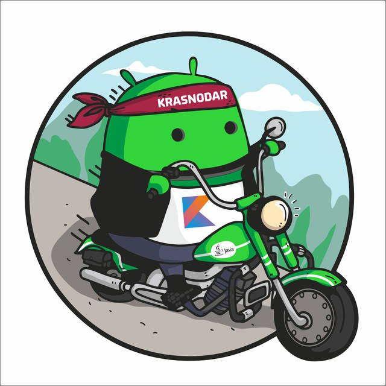

# 🎨 KRD Compose

KRD Compose — это открытая коллекция визуальных решений, разработанных с использованием Jetpack
Compose сообществом [Android Krasnodar](https://t.me/androidkrd).

В проект входят:

- 🧩 Гибкие и переиспользуемые компоненты интерфейса
- ✨ Анимации и эффекты, демонстрирующие возможности современного Compose
- 🎮 Мини-игры с красивой UI-обёрткой

Проект задуман как полигон для экспериментов, обмена опытом и
развития [локального](https://t.me/androidkrd) Android-сообщества
через практику и открытый код.

Проект, написанный на Jetpack Compose и Kotlin, включает игры и компоненты пользовательского
интерфейса.

💡 Проект открыт для новых участников! Если у вас есть идеи для новых компонентов, анимаций или
мини-игр — не стесняйтесь присоединяться. KRD Compose растёт вместе с сообществом и будет рад любым
инициативам.

## 🧩 Компоненты

- **[DataSlider](specification/components/dataslider.md)** — компонент слайдера для удобного
  просмотра данных.
- **[PascalTriangle](specification/components/pascaltriangle.md)** — Кастомизируемый треугольник
  Паскаля.
- **[NumberSystemConverter](specification/components/numberSystemConverter.md)** — Конвертер систем
  счисления с визуализацией битов.
- **[PythagorasTree](specification/components/pythagorasTree.md)** — Отображает классическое
  **дерево Пифагора** на `Canvas` и может плавно анимировать угол между ветвями.
- **[ColorPickerDialog](specification/components/colorPickerDialog.md)** — компонент позволяющий
  пользователю выбрать цвет в формате RGBA (Red, Green, Blue, Alpha) через слайдеры.
- **[ScanHighlight](specification/components/scanHighlight.md)** — компонент для создания эффекта
  сканирования.
- **[DecodedContent](specification/components/decodedContent.md)** — компонент для создания эффекта
  **декодирования данных**.

## 🎮 Игры

- **[Сапёр](specification/games/sapper.md)** — реализация классической игры с настраиваемой
  сложностью и таймером
- **[Змейка](specification/games/snake.md)** — реализация классической игры "Змейка"
- **[Шахматы](specification/games/chess.md)** — реализация игры "Шахматы" человек vs человек с
  классическими правилами FIDE
- **[Колесо фортуны](specification/games/fortuneWheel.md)** — реализация игры "Колесо фортуны".
  Крутите барабан!
- **[Ханойские башни](specification/games/hanoi.md)** — Игра «Ханойские башни» с плавной анимацией и
  встроенным авто‑решателем.
- **[Гонки](specification/games/racing.md)** — Аркадная мини‑игра в духе «тетрис‑гонок». Ваша
  задача — уводить машину от встречных авто и препятствий как можно дольше, набирая очки.
- **[Судоку](specification/games/sudoku.md)** — Классическая игра "Судоку"

## 🔮 Разное

- **[Симулятор орбит](specification/others/kepler.md)** — Учебное приложение, иллюстрирующее
  ньютоновскую динамику и законы Кеплера.
- **[Множество Мандельброта](specification/others/mandelbrot.md)** — Анимируемый фон множества
  Мандельброта для Jetpack Compose.
- **[Трещенки](specification/others/сracks.md)** — Генерация реалистичных трещин на поверхности.
  Рендер происходит на GPU через AGSL (`RuntimeShader`).
- **[Сфера 3D](specification/others/sphere3d.md)** — 3D-сфера, рендерящаяся с помощью AGSL.
## 🚀 Запуск проекта

```bash
git clone https://github.com/i-redbyte/krdcompose.git
cd krdcompose
./gradlew build
```

## ✨ Вклад

Сделайте форк репозитория

Создайте ветку (git checkout -b feature/новая-фича)

Внесите изменения и запушьте их (git push origin feature/новая-фича)

Создайте Pull Request


<p align="center">
  
</p>

## Contributors

[](https://github.com/i-redbyte/krdcompose/graphs/contributors)
